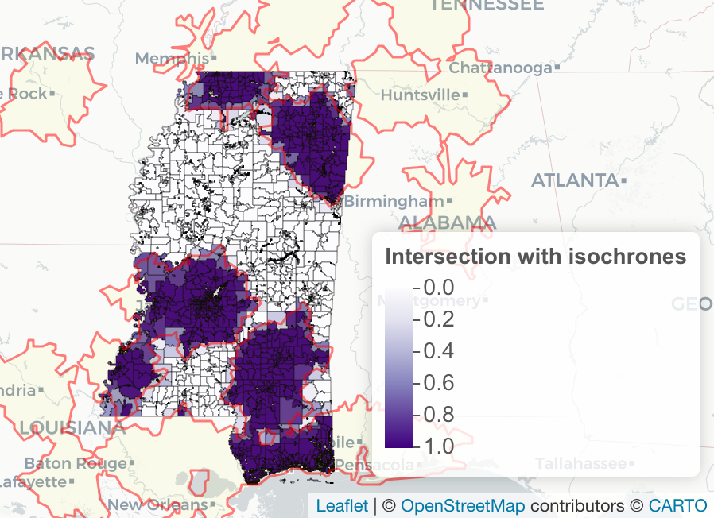

```{r setup, include=FALSE}
knitr::opts_knit$set(root.dir = "/Users/hannahrecht/Documents/r-drive-time-analysis-tutorial/") 
knitr::opts_chunk$set(
  echo = TRUE,
  fig.dim = c(8, 6),
  dev = "png",
  fig.path = "/Users/hannahrecht/Documents/r-drive-time-analysis-tutorial/docs/img/"
)

```

This tutorial demonstrates how to do a drive time analysis in R. Drive time analyses can answer what areas lie within a specified driving time from a certain point, and what are the demographics of the people inside and outside that area.

The tutorial is adapted from [code](https://github.com/khnews/2021-delta-appalachia-stroke-access) used in the analysis for [In Appalachia and the Mississippi Delta, Millions Face Long Drives to Stroke Care](https://khn.org/news/article/appalachia-mississippi-delta-stroke-treatment-advanced-care-rural-access/). The story was a collaboration between KHN and InvestigateTV and published in May, 2021.

This is a simplified analysis based on that larger project. It looks at how many Mississippi state residents live within 45-minutes of a stroke center and how many live further away.

The basic process we'll follow is:

1.  Get a dataset of locations of interest

2.  Retrieve a drive-time isochrone for each point

3.  Calculate how much each Census block group in our area of interest overlaps with the isochrones

4.  Get population data for each block group

5.  Calculate how many people live within the isochrones and how many people live outside, using our block group data

IMPORTANT NOTE: the isochrones used in this analysis were calculated several weeks ago for the story published in early May. Road closures and other changes will affect the drive time results. If you try to replicate this and run the isochrone code here you will likely get slightly different results. This is to be expected.

## Requirements

This analysis requires intermediate R skills and some knowledge of geospatial operations. It also requires a [HERE API key](https://developer.here.com/) and a [U.S. Census Bureau API key](https://api.census.gov/data/key_signup.html) for data retrieval.

It requires the following packages. Install them if you haven't already

```{r install_oackages, eval = FALSE}
install.packages(c("dplyr", "tidyr", "sf", "leaflet", "tigris", "ggplot2", "hereR", "censusapi"))
```

## Preparation

We'll get stroke center locations from the published [KHN analysis](https://github.com/khnews/2021-delta-appalachia-stroke-access). You can read how we collected the locations in that repo.

```{r load_data, message = FALSE, warning = FALSE}
library(dplyr)
library(tidyr)
library(sf)
library(leaflet)
library(tigris)
library(ggplot2)
library(hereR)
library(censusapi)

stroke_centers <- read.csv("https://raw.githubusercontent.com/khnews/2021-delta-appalachia-stroke-access/main/data/stroke-centers.csv", colClasses = c("fips_county" = "character", "zip" = "character"))

head(stroke_centers)

# Make centers an sf object
stroke_centers <- st_as_sf(stroke_centers, coords = c("longitude", "latitude")) %>% 
	st_set_crs(4326)
```

The stroke centers dataset includes locations in the Mississippi Delta and Appalachia and surrounding states. For this tutorial we'll just focus on those in and near Mississippi, but map the full dataset to see what it includes.

```{r hospital_map}
leaflet() %>% 
	setView(
		-86.7667415602124, 36.188530779087586,
		zoom = 5) %>%
	addProviderTiles("CartoDB.Voyager") %>% 
	addCircles(
		data = stroke_centers, 
		radius = 6,
		color = "darkgreen",
		opacity = 0.6, 
		popup = paste0(stroke_centers$name, "<br />",
									 stroke_centers$city, ", ", stroke_centers$state))
```

## Filter stroke centers with `st_buffer` and `st_intersects`

We don't need all of these locations for out Mississippi anaysis.

We'll want to filter the dataset down to just stroke centers in and near Mississippi - anywhere you could possibly reach in a 45-minute drive from any point in the state.

To choose those relevant locations, we'll create an 100 mile buffer from the state border. (100 miles is a lot for 45 minutes even if driving in a perfectly straight line, but let's be safe.)

We'll get high-quality state boundaries from the US Census Bureau using the `tigris` package, select just Mississippi, and then expand the boundary by 100 miles in every direction.

Important note: for computations in sf we should use a planar projection, [not a lat/long projection](https://r-spatial.github.io/sf/articles/sf6.html#although-coordinates-are-longitudelatitude-xxx-assumes-that-they-are-planar) like we'd use for making Leaflet maps. We'll use projection ESPG [2163](https://epsg.io/2163).

```{r state_boundary, message = FALSE, warning = FALSE, results = "hide"}
states <- states()
ms_boundary <- states %>% filter(STUSPS == "MS")
ms_boundary <- ms_boundary %>% st_transform(2163)
```

Now make a buffer using the `st_buffer()` function. Google tells me that 100 miles = 160,934 meters.

```{r state_buffer}
ms_buffer <- st_buffer(ms_boundary, dist = 160934)

# Show the buffer to make sure it makes sense
stroke_centers <- stroke_centers  %>% st_transform(2163)
ggplot() + 
	geom_sf(data = ms_boundary, color = "blue") + 
	geom_sf(data = ms_buffer, fill = NA, color = "red") +
	geom_sf(data = stroke_centers) +
	theme_void() 
```

Then filter the stroke centers to include just those within our 100 mile state buffer.

```{r filter_centers}
centers_ms <- stroke_centers %>% filter(st_intersects(geometry, ms_buffer, sparse = FALSE))

# Do the states make sense for a buffer around MS?
table(centers_ms$state)

# Now let's plot those on a leaflet map to see where they are
# Project back first - can't put projected coordinates on a leaflet map
centers_ms_map <- centers_ms %>% st_transform(4326)
leaflet() %>% 
	addProviderTiles("CartoDB.Voyager") %>% 
	addCircles(
		data = centers_ms_map, 
		radius = 6,
		color = "darkgreen",
		opacity = 0.6)
```

## Retrieve isochrones with the `hereR` package

Now that we have our set of stroke centers, we'll get the 45-minute drive time radius for each one using the [hereR](https://munterfinger.github.io/hereR/) package. This package wraps the [HERE Technologies](https://developer.here.com/) API. You'll need a developer key to use it. This small project fits well within the freemium tier, as of May 2021.

We'll use hereR's `isoline()` function to get the isochrones.

Once in a while you might have a server issue or some other error. I like to wrap the API function in a `tryCatch()` function so that if any one point fails the rest still go forward. If you're new to error handling, [Hadley Wickham's primer](https://adv-r.hadley.nz/conditions.html?q=trycat#conditions) is helpful.

Then, if any points did fail, I loop through the list that failed to try them again. If you're using a larger dataset I highly recommend having a setup like this so that you're not making a bunch of API hits only to hit an error and abort your whole script.

```{r get_isochrones, eval = FALSE}
tryLocation <- function(location) {
	out <- tryCatch({
		temp <- isoline(
			poi = location,
			# range is in seconds - we want 45 minutes, so multiply by 60
			range = 45 * 60,
			range_type = "time",
			transport_mode = "car",
			url_only = F,
			optimize = "quality",
			traffic = F,
			aggregate = F
		)
		temp <- temp %>%
			mutate(hospital_id = point_id)
		return(temp)},
		
		error = function(cond) {
			message(paste("Hospital ID failed: ", point_id))
			message(paste(cond))
			# Choose a return value in case of error
			return(NULL)},
		
		warning = function(cond) {
			message(paste("Hospital ID caused a warning:", point_id))
			message(paste(cond))
			# Choose a return value in case of warning
			return(NULL)
		})    
	return(out)
}


# Loop over points to make isochrones file
# Using a timer to avoid rate limit errors (Status 429)
isochrones <- NULL
error_rows <- NULL
for (i in 1:nrow(centers_ms)) {
	print(i)
	# Get isochrones for that point
	# Lately the rate limiting has been more aggressive, so do an aggressive second delay
	# In the past I've used 0.15 seconds without issue but not right now
	Sys.sleep(0.4)
	# Filter to ith point
	point_temp <- centers_ms %>% filter(row_number() == i)
	point_id <- point_temp$hospital_id
	
	isochrones_temp <- tryLocation(point_temp)
	
	# If the point errored out save it
	if (is.null(isochrones_temp)) {
		error_rows <- bind_rows(error_rows, point_temp)
	} else {
		isochrones <- bind_rows(isochrones, isochrones_temp)	
	}
}
rm(isochrones_temp, point_temp)
```

Now join information like hospital name and city from the centers_ms dataframe to the isochrones for later use.

```{r isochrones_save, eval = FALSE}
# Add characteristics to isochrones file, save out
# Want to join a plain data frame to the isochrones, not an sf object
centers_df <- as.data.frame(centers_ms) %>%
	select(-geometry)

isochrones <- left_join(isochrones, centers_df, by = "hospital_id")

isochrones <- isochrones %>%
	mutate(drive_time = range/60) %>%
	select(-range, -departure, -arrival, -id, -rank) %>%
	select(hospital_id, drive_time, everything()) %>% 
	arrange(state, city, hospital_id, drive_time)

```

Map the isochrones to make sure they make sense. We should see one isochrone per point.

```{r read_isochrones, echo = FALSE, message = FALSE, warning = FALSE}
# To avoid hitting the API too often they were retrieved and saved in advanced, rather than running that code when compiling the markdown page.
isochrones <- readRDS("data/isochrones.rds")
isochrones <- isochrones %>% filter(drive_time == 45 & hospital_id %in% centers_ms$hospital_id)
```

```{r map_isochrones}
leaflet() %>% 	
	addProviderTiles("CartoDB.Voyager") %>% 
	addPolygons(
		data = isochrones, 
		fillColor = "forestgreen",
		fillOpacity = 0.5, 
		stroke = FALSE)
```

## Calculate isochrone and Census block group overlap

To calculate how many people live within and outside of the drive time isochrones, we'll need to identify the percent of each Census block group that lies within the isochrones.

Note: you might see some simplified analyses that look at block group centroids instead of calculating the overlap. If you're working with a massive dataset that type of approach can make sense. But there's no need to simplify so much here.

The block group shapefile is from the 2019 ACS via [NHGIS](https://www.nhgis.org/). This file is clipped to shorelines but not interior bodies of water like lakes. It was clipped to water in the [original project](https://github.com/khnews/2021-delta-appalachia-stroke-access) using the [USGS NHD files](https://www.usgs.gov/core-science-systems/ngp/national-hydrography/access-national-hydrography-products). See that project for full details of the water clipping, which is not reproduced here.

Block group boundaries do not follow lake or other inland water boundaries. So if a lake takes up 50% of the block group, that makes a big difference for drive time calculations. Exclude water, since people don't live in those lakes and ponds --- unless you're in an area with a lot of people in houseboats.

First, make our block groups and isochrones planar and then valid for computation (fixing any minor shape issues) using `st_make_valid()`.

```{r prep_shp}
# Read in MS block group shapefile, clipped to water
bg_shp <- st_read("data/shp/ms-block-groups.shp")

# Make files planar and valid, needed for sf computation
bg_shp <- bg_shp %>% st_transform(2163)
bg_shp <- st_make_valid(bg_shp)

isochrones <- isochrones %>% st_transform(2163)
isochrones <- st_make_valid(isochrones)
```

For computation, we don't care about individual isochrones, many of which overlap. Instead we just want to know how a block group fits in with any of the isochrones period, not each individual one. So combine them into one single feature with `st_union()` and then make into a nice sf object with `st_sf()`.

```{r join isochrones}
isochrones_joined <- st_union(isochrones)
isochrones_joined <- st_sf(iso_id = 1, geometry = isochrones_joined) %>% 
	st_transform(2163)
```

Make another quick reference map to make sure you have just one single isochrones feature. Remember before you could see all the overlapping shapes - now it should look like one.

```{r isochrones_joined_map}
isochrones_joined_map <- isochrones_joined %>% st_transform(4326)

leaflet() %>% 	
	addProviderTiles("CartoDB.Voyager") %>% 
	addPolygons(
		data = isochrones_joined_map, 
		fillColor = "forestgreen",
		fillOpacity = 0.5, 
		stroke = FALSE)
```

Now calculate the percent overlap between each block group and the isochrones.

```{r calculate_overlap}
# Calculate area in all block groups
bg_shp <- mutate(bg_shp, bg_area = st_area(bg_shp))

# Calculate intersection - will take some minutes
intersect <- st_intersection(bg_shp, isochrones_joined) %>% 
		mutate(intersect_area = st_area(.)) %>%
		select(GEOID, intersect_area) %>% 
		st_drop_geometry()
	
# Merge intersection area by geoid
bg_shp <- left_join(bg_shp, intersect, by = "GEOID")

# Calculate overlap percent between block groups and isochrones
bg_shp <- bg_shp %>% 
	# If missing it's because it didn't overlap, so 0
	mutate(intersect_area = ifelse(is.na(intersect_area), 0, intersect_area),
		overlap = as.numeric(intersect_area/bg_area))

# Summary of the overlap percents
summary(bg_shp$overlap)
```

Now map the percent overlap with isochrones to make sure they make sense. Block groups that are fully within the isochrones (100%) should be darkest purple while those that are fully outside (0%) are white. Those one the edges should be in between. This is too much data for Rmarkdown to render easily so I've run it separately and saved a screenshot. Definitely do not run this on national block groups in R, it will crash!

```{r overlap_map, eval = FALSE}
bg_ms <- bg_shp %>% st_transform(4326)

pal <- colorNumeric("Purples", domain = bg_ms$overlap)

# All stroke centers
leaflet() %>%
	addProviderTiles("CartoDB.Positron") %>%
	setView(
		-86.7667415602124, 36.188530779087586,
		zoom = 5) %>%
	addPolygons(
		data = bg_ms , 
		fillColor = ~pal(bg_ms$overlap), 
		fillOpacity = 1, 
		weight = 0.5, 
		smoothFactor = 0.2, 
		stroke = TRUE,
		color = "black") %>%
	# Isochrone outlines
	addPolygons(
		data = isochrones_joined_map, 
		fill = TRUE,
		stroke = TRUE,
		fillColor = "yellow",
		fillOpacity = 0.05,
		color = "red",
		weight = 1.5) %>%
	addLegend(pal = pal, 
						values = bg_ms$overlap, 
						position = "bottomright", 
						title = "Intersection with isochrones",
						opacity = 1)
```



## Calculate populations within and further than a 45-minute drive

We'll get the population in each block group using the [censusapi](https://www.hrecht.com/censusapi/) library. If you're interested in stratifying by stroke center type or race, see the [original project code](https://github.com/khnews/2021-delta-appalachia-stroke-access). Here we'll just look at overall population within 45-minutes of any stroke center.

```{r get_population}
acs_raw <- getCensus(
	name = "acs/acs5",
	vintage = 2019,
	vars = c("NAME", "B01001_001E"),
	region = "block group:*",
	regionin = "state:28&in=county:*&in=tract:*")

demographics_bg <- acs_raw %>% 
	rename(name = NAME,
				 population = B01001_001E,
				 fips_state = state) %>%
	mutate(
		fips_block_group = paste0(fips_state, county, tract, block_group),
	) %>%
	arrange(fips_state) %>%
	select(fips_block_group, name, population)

head(demographics_bg)
```

And finally! Multiply the population of each block group by its overlap percent to calculate population within and not within 45-minutes of a stroke center.

First, make a flat non-sf dataframe with the overlap information and join to population. Then multiply and summarize. This is the easiest part of the project.

```{r calculate_population}

bg_overlap <- bg_shp %>% select(geoid = GEOID, overlap) %>%
	st_drop_geometry()
bg_overlap <- as.data.frame(bg_overlap)

# Join data
bg <- left_join(bg_overlap, demographics_bg, by = c("geoid" = "fips_block_group"))

# Calculate!
state_sums <- bg %>% select(geoid, overlap, population) %>%
	summarize(within_total = sum(population * overlap),
						population_total = sum(population)) %>%
	mutate(within_total_pct = within_total/population_total) %>%
	ungroup()

state_sums
```

And now we know: 68% of Mississippi residents live within 45 minutes of a stroke center, while the remaining 32% live further away.
